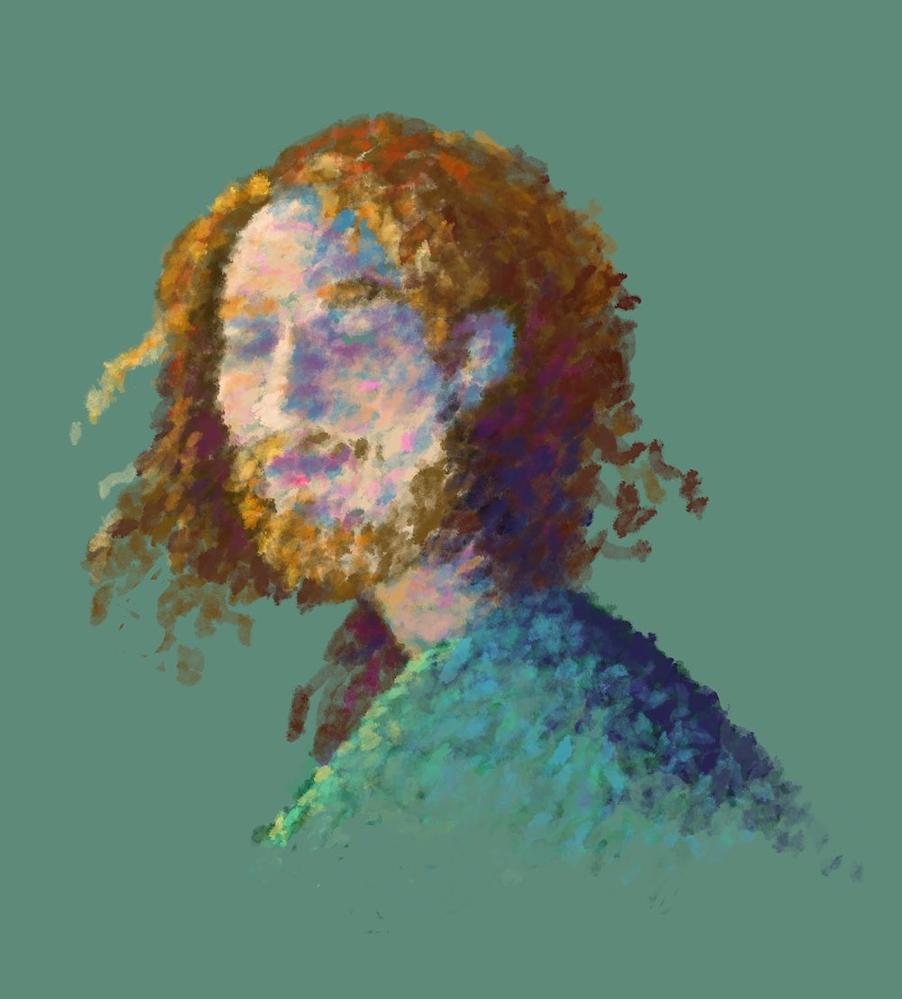

# Murilo Polese - Gallery

In [Recreating the Past](https://murilopolese.github.io/RTP_SFPC_SUMMER20),
[I](http://www.murilopolese.com/) studied computational art from the past decades and recreated these works with contemporary techniques to gain aesthetic, analytical and technical knowledge.

Since then I continue learning from the past, present and future. (Never graduate!)

All code (including this website) can be found on the [repository](https://github.com/murilopolese/gallery).

You can download it directly as a [compressed file](https://github.com/murilopolese/gallery/archive/master.zip).

You can also read the [research documents](./research/output/index.html) (gathered with immense help from friends).
