# Carlos Cruz-Diez

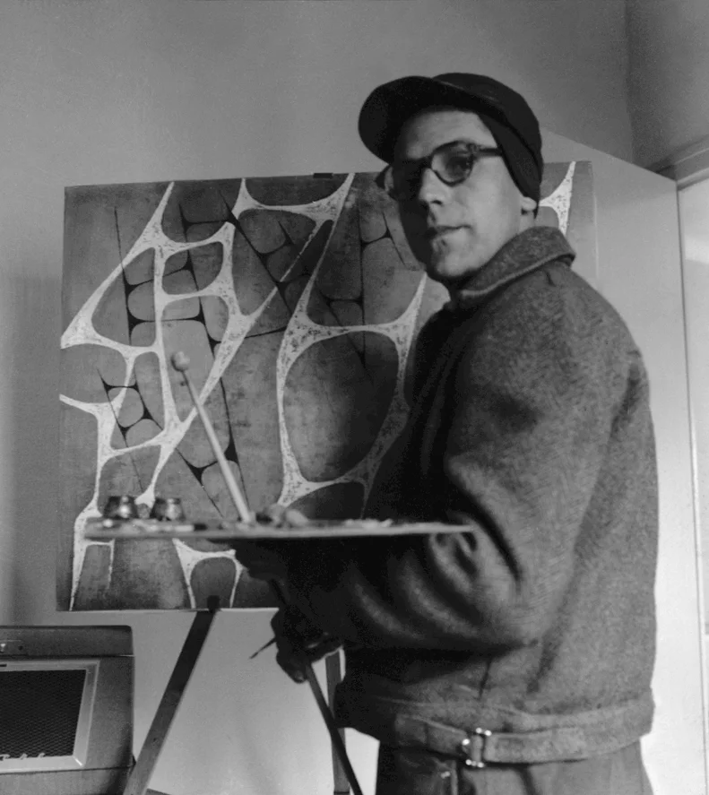

Carlos Eduardo Cruz-Diez (Caracas, Venezuela, 17 de agosto de 1923-París, Francia, 27 de julio de 2019)1​ fue un artista venezolano del arte cinético. Vivió y trabajó en París desde 1960 hasta su muerte.2​ Cruz-Diez propuso concebir el color como una realidad autónoma que se desarrolla en el tiempo y en el espacio, sin ayuda de la forma o necesidad de soporte. Su trabajo abarca ocho investigaciones: Couleur Additive, Physichromie, Induction Chromatique, Chromointerférence, Transchromie, Chromosaturation, Chromoscope y Couleur à l’Espace.3​

https://es.wikipedia.org/wiki/Carlos_Cruz-Diez

http://www.cruz-diez.com/

# Obras

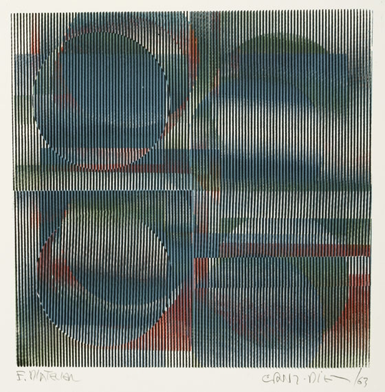

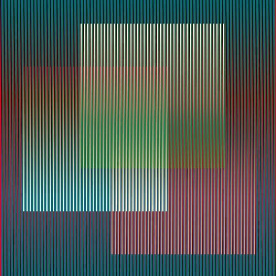

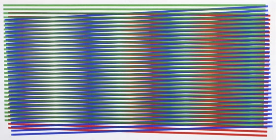

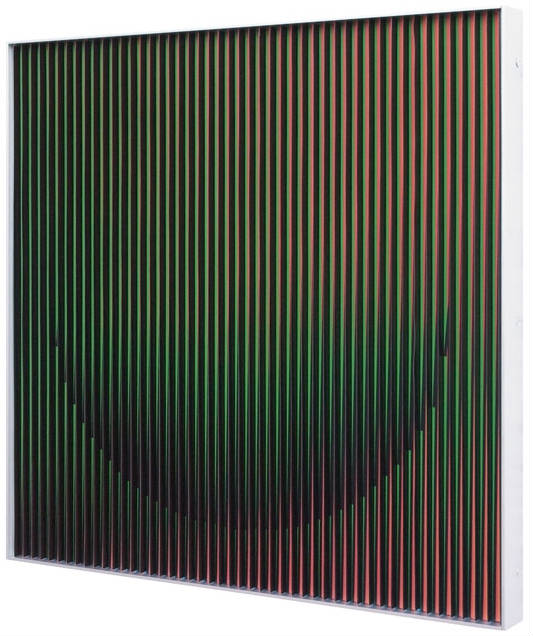

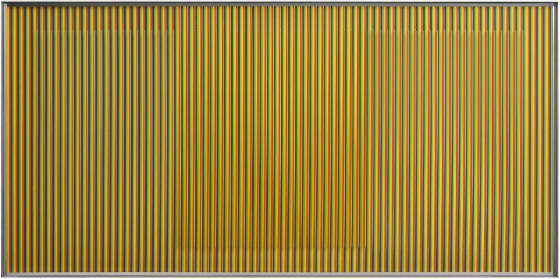

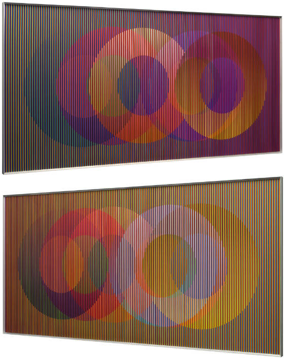

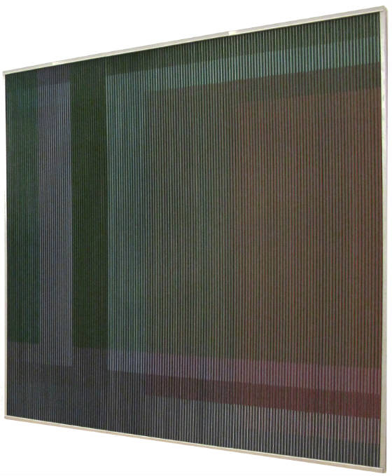

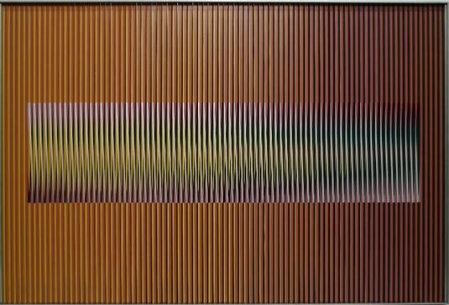

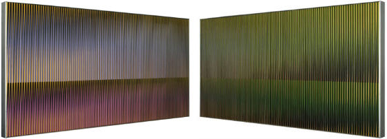

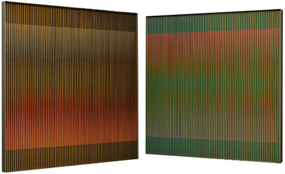

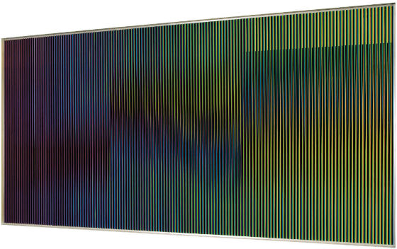

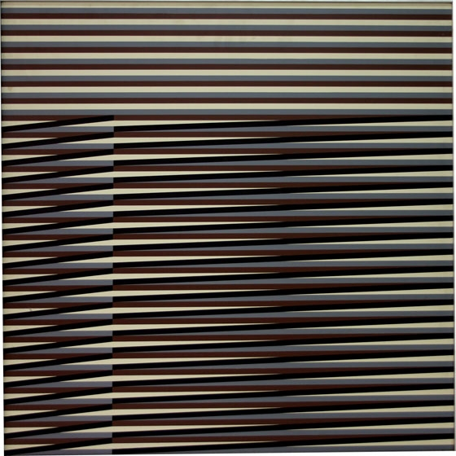

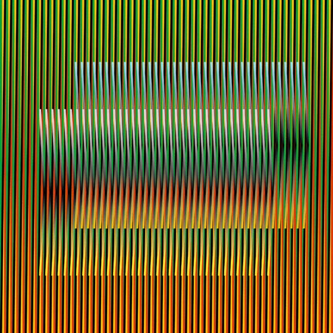

# Exibiçōes

- https://www.wallpaper.com/art/carlos-cruz-diez-phillips-x-exhibition-platform
