# Eduardo Kac

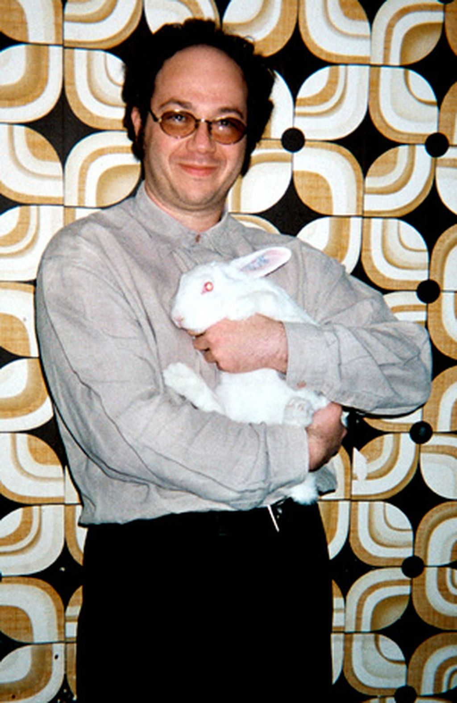

Nasceu em 1962, Rio de Janeiro. Vive e trabalha em Chicago.

Amplamente reconhecido por seu trabalho inovador on-line antes do advento da Web, particularmente sua arte de telepresença, Kac desenvolveu novas formas poéticas, como a holopoesia, a poesia digital e a aromapoesia. Seu trabalho tem progressivamente se concentrado nas relações entre os seres humanos e entre máquinas, animais e outras formas de vida. O trabalho de Kac busca, além da exploração da linguagem humana e cultural, abranger a comunicação entre todos os organismos vivos. Visualmente e intelectualmente estimulante, sua arte promove uma combinação visionária entre robótica, biotecnologia e networking. Kac usa processos de comunicação, a vida biológica e redes digitais para criar trabalhos que explorem as experiências humanas fundamentais, tais como a fluidez da linguagem, a interação dialógica e a consciência do nosso lugar relativo na comunidade viva maior.

https://lucianacaravello.com.br/artistas/eduardo-kac/

Eduardo Kac (Rio de Janeiro, 3 de julho de 1962[2]) é um artista contemporâneo e pioneiro da arte digital, arte holográfica, arte da telepresença e bioarte.

https://pt.wikipedia.org/wiki/Eduardo_Kac

# Obras

- [Site oficial de Eduardo Kac](https://ekac.org/)

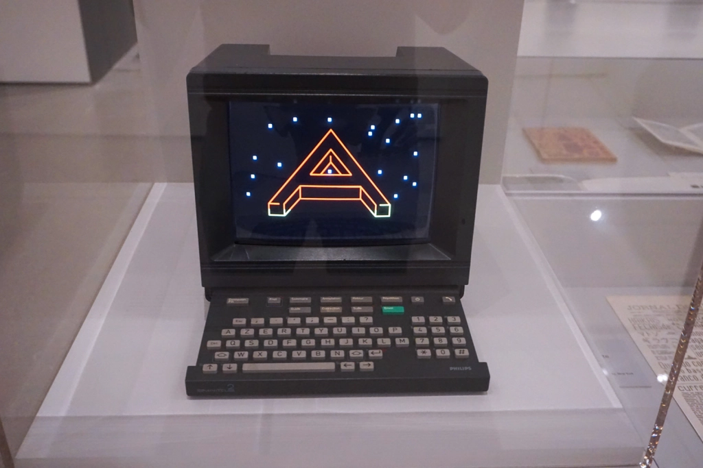

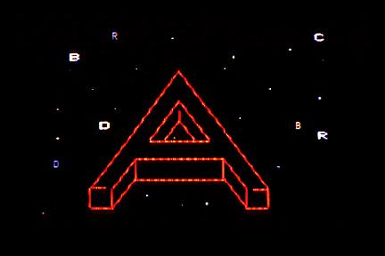
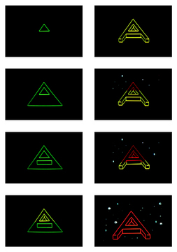

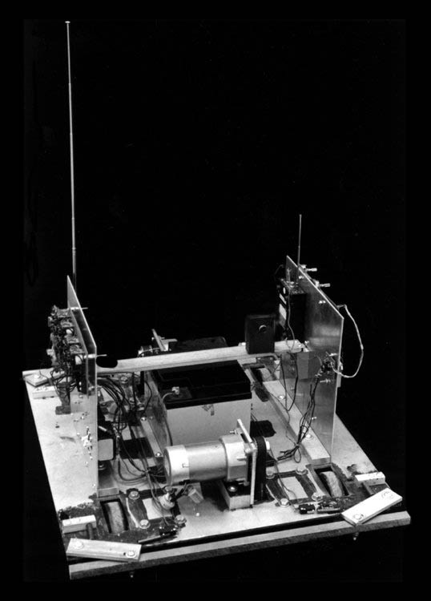

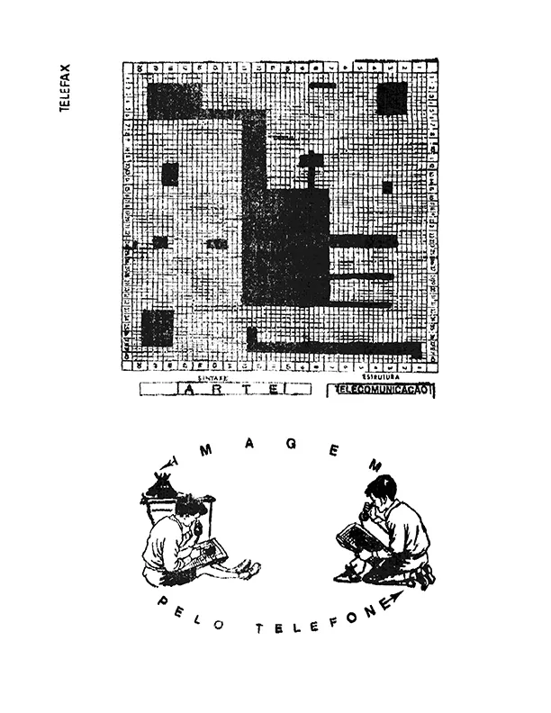
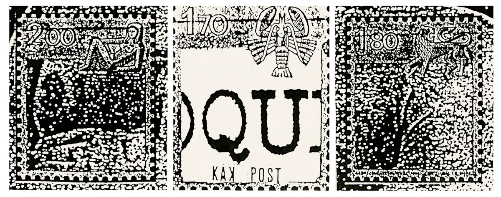

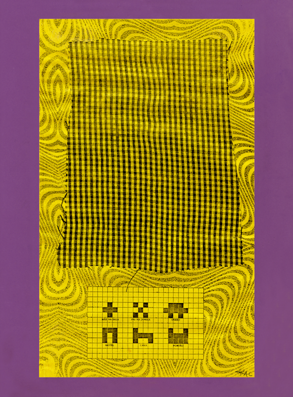

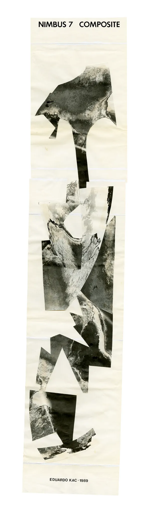
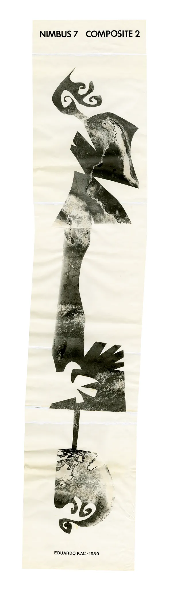

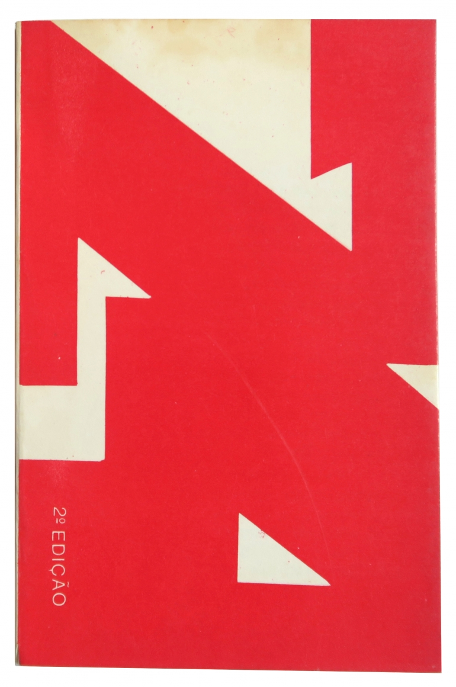
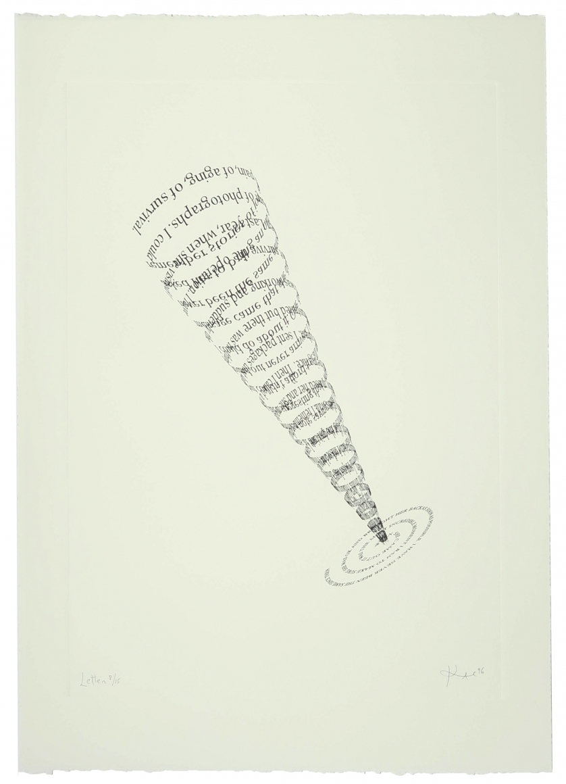

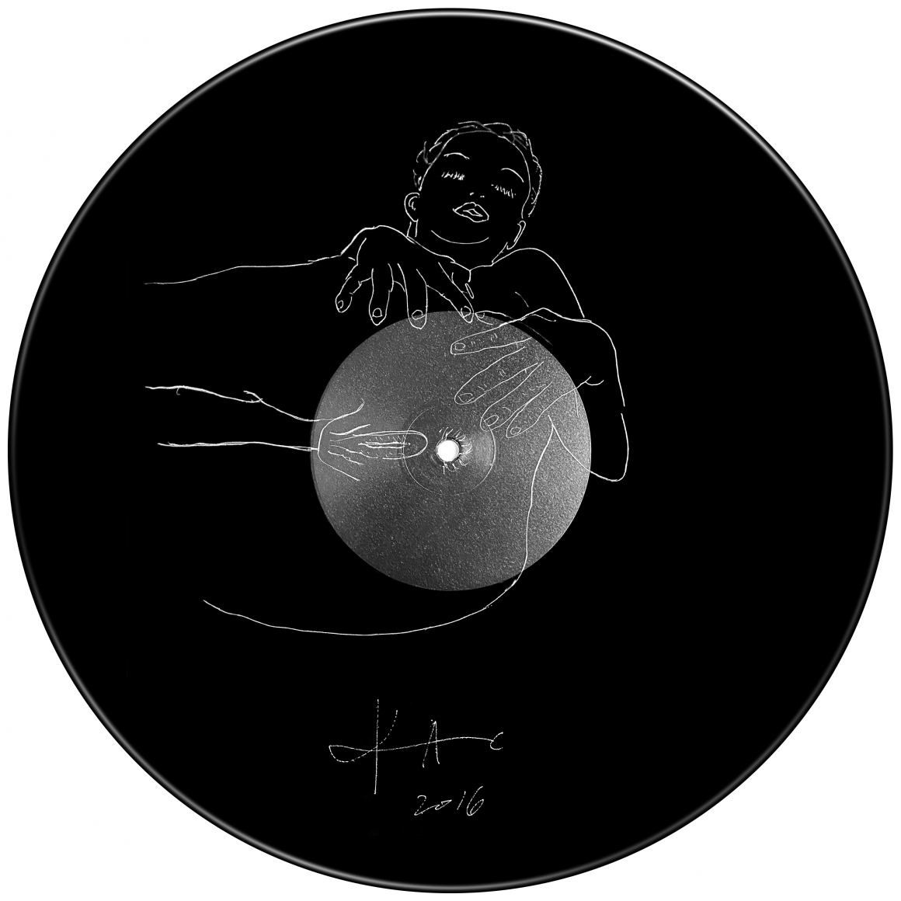

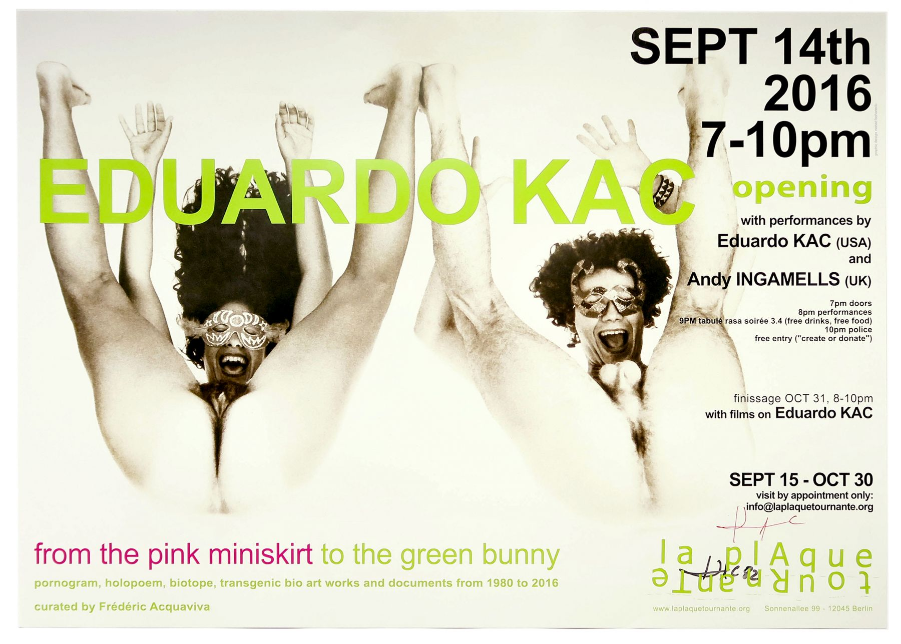

# Artigos

- https://www.select.art.br/eduardo-kac-no-moma/
- https://rhizome.org/editorial/2016/nov/03/when-net-art-outlives-the-net-eduardo-kacs-poetry-for-videotexto/
- https://anthology.rhizome.org/reabracadabra
- https://rhizome.org/editorial/2016/dec/05/tropical-minitel/
