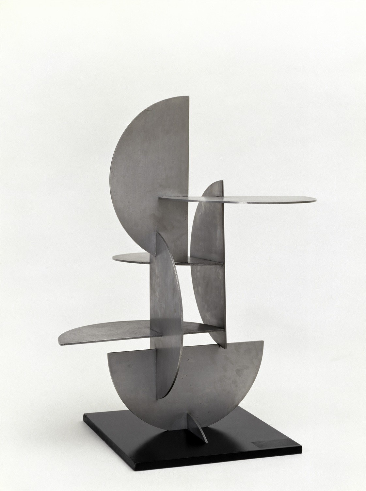
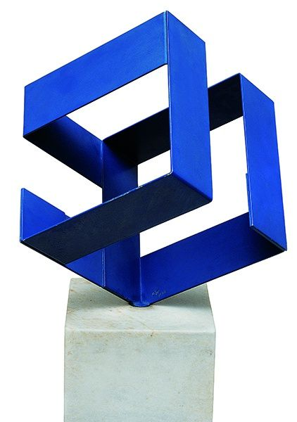
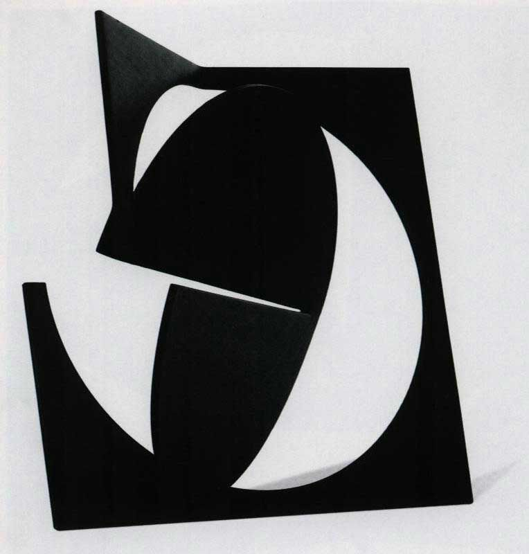

# Franz Weissman
http://fw.art.br/

**Franz Josef Weissmann** (September 15, 1911 – July 18, 2005) was a Brazilian sculptor born in Austria, emigrating to Brazil while he was eleven years old.[[1]](https://en.wikipedia.org/wiki/Franz_Weissmann#cite_note-1) Geometric shapes, like cubes and squares, are strongly featured in his works. He was one of the founders of the [Neo-Concrete Movement](https://en.wikipedia.org/wiki/Neo-Concrete_Movement).

**Franz Josef Weissmann** ([Knittelfeld](https://pt.wikipedia.org/wiki/Knittelfeld), [Áustria](https://pt.wikipedia.org/wiki/%C3%81ustria), [15 de setembro](https://pt.wikipedia.org/wiki/15_de_setembro) de [1911](https://pt.wikipedia.org/wiki/1911) — [Rio de Janeiro](https://pt.wikipedia.org/wiki/Rio_de_Janeiro_(cidade)), [18 de julho](https://pt.wikipedia.org/wiki/18_de_julho) de [2005](https://pt.wikipedia.org/wiki/2005)) foi um [escultor](https://pt.wikipedia.org/wiki/Escultura) [brasileiro](https://pt.wikipedia.org/wiki/Brasil) nascido na Áustria, emigrou para o Brasil com onze anos de idade. É uma das principais referências brasileiras na Escultura.

Franz Josef Weissmann veio para o [Brasil](https://pt.wikipedia.org/wiki/Brasil) em [1921](https://pt.wikipedia.org/wiki/1921). No [Rio de Janeiro](https://pt.wikipedia.org/wiki/Rio_de_Janeiro_(cidade)), entre [1939](https://pt.wikipedia.org/wiki/1939) e [1941](https://pt.wikipedia.org/wiki/1941), frequentou cursos de [arquitetura](https://pt.wikipedia.org/wiki/Arquitetura), [escultura](https://pt.wikipedia.org/wiki/Escultura), [pintura](https://pt.wikipedia.org/wiki/Pintura) e [desenho](https://pt.wikipedia.org/wiki/Desenho) na [Escola Nacional de Belas Artes](https://pt.wikipedia.org/wiki/Escola_Nacional_de_Belas_Artes) (Enba).

- https://en.wikipedia.org/wiki/Franz_Weissmann
- https://pt.wikipedia.org/wiki/Franz_Weissmann

https://www.youtube-nocookie.com/embed/D1ZuIaFYuKY
https://www.youtube-nocookie.com/embed/0TfT4aXBa3c
https://www.youtube-nocookie.com/embed/iMGc-4qprF8

## Obras

https://www.pinterest.co.uk/aj7861/franz-weissman/

## Exposições

https://www.youtube-nocookie.com/embed/zvBxJhyziZg

Franz Weissman questao de prova: https://web.archive.org/web/20040329201522/http://www.convest.unicamp.br/vest_ant/2002/download/comentadas/Arquitetura.pdf
