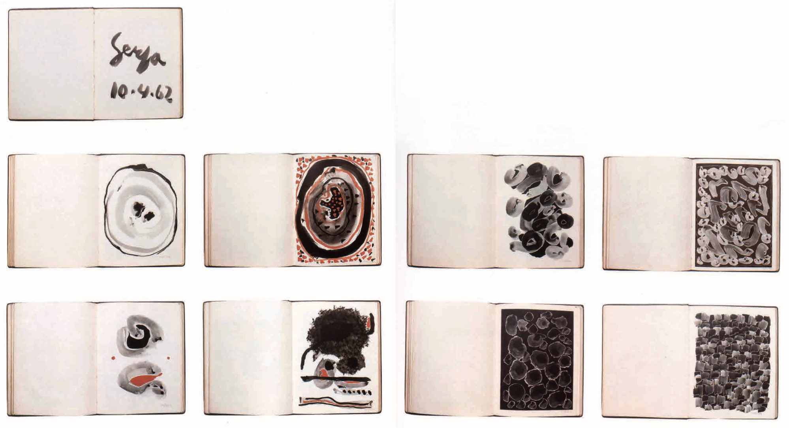

# Ivan Serpa

**Ivan Ferreira Serpa** (April 6, 1923–April 6, 1973) was a Brazilian painter, draftsman, printmaker, designer, and educator active in the [concrete art](https://en.wikipedia.org/wiki/Concrete_art) movement.[[1]](https://en.wikipedia.org/wiki/Ivan_Serpa#cite_note-OGlobo-HeraldoSerpa-2017-1) Much of his work was in [geometric abstractionism](https://en.wikipedia.org/wiki/Geometric_abstraction). He founded [Grupo Frente](https://en.wikipedia.org/wiki/Grupo_Frente), which included fellow artists [Lygia Clark](https://en.wikipedia.org/wiki/Lygia_Clark), [Helio Oiticica](https://en.wikipedia.org/wiki/Helio_Oiticica), and [Franz Weissmann](https://en.wikipedia.org/wiki/Franz_Weissmann), among others, and was known for mentoring many artists in Brazil.[[2]](https://en.wikipedia.org/wiki/Ivan_Serpa#cite_note-ColdAmerica-2011-2)[[3]](https://en.wikipedia.org/wiki/Ivan_Serpa#cite_note-DickinsonRoundell-PioneeringAbstraction-2012-3)

In 1954, Serpa published a book he wrote with [Mario Pedrosa](https://en.wikipedia.org/w/index.php?title=Mario_Pedrosa&action=edit&redlink=1) called, *Crescimento e criação,* which incorporated his work as a teaching children. He often gave free art classes to children.[[9]](https://en.wikipedia.org/wiki/Ivan_Serpa#cite_note-CrescimentoECriacao-1954-9)

- https://en.wikipedia.org/wiki/Ivan_Serpa
- http://enciclopedia.itaucultural.org.br/pessoa8922/ivan-serpa

## Livros e catálogos

- https://digital.march.es/fedora/objects/cat:170/datastreams/PDF/content
- https://issuu.com/simoncdickinsonltd/docs/serpa_cat_issue
- Werneck Barcinski, Fabiana; Siqueira, Vera Beatriz; Dias Ferreira, Hélio Márcio (2003). [*Ivan Serpa*](https://www.btgpactual.com/home/media/Livro06-Baixa.pdf) (PDF) (in Portuguese). Rio de Janeiro: Instituto Cultural The Axis. [ISBN](https://en.wikipedia.org/wiki/ISBN_(identifier)) [978-8-588-72002-2](https://en.wikipedia.org/wiki/Special:BookSources/978-8-588-72002-2). [OCLC](https://en.wikipedia.org/wiki/OCLC_(identifier)) [56360650](https://www.worldcat.org/oclc/56360650).

## Artigos e citaçōes

- https://news.artnet.com/art-world/grupo-frente-at-gelerie-lelong-1005977
- https://oglobo.globo.com/cultura/artes-visuais/casa-onde-ivan-serpa-manteve-atelie-no-meier-guarda-objetos-pessoais-obras-inacabadas-21693305

> The well-traveled and educated Pedrosa became a close friend and was responsible for exposing Serpa to several leading twentieth-century intellectuals writting about art and pedagogy internationally, including the American educational reformer John Dewey (…) they all believed children had the benefit of a natural state of unselfconsciousness, and, when creating art, should be allowed to develop their abilities unfettered.

[Fonte](https://issuu.com/simoncdickinsonltd/docs/serpa_cat_issue)

## Obras

