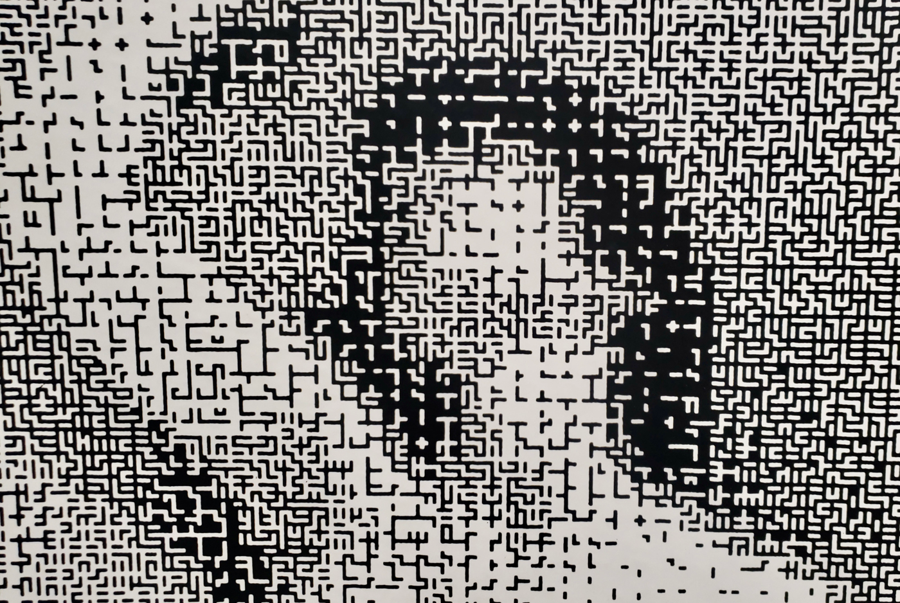

# Lillian Schwartz

## Bio

**Lillian F. Schwartz** (born 1927) is a 20th-century [American](https://en.wikipedia.org/wiki/United_States_of_America) artist considered a pioneer of computer-mediated art and one of the first artists notable for basing almost her entire oeuvre on computational media. Many of her ground-breaking projects were done in the 1960s and 1970s, well before the desktop computer revolution made computer hardware and software widely available to artists.

## Website:
- http://lillian.com/films/
-
- http://lillian.com/documentaries/
## Films
https://player.vimeo.com/video/116553250

[https://vimeo.com/116553250](https://vimeo.com/116553250)

https://player.vimeo.com/video/98960229

[https://vimeo.com/98960229](https://vimeo.com/98960229)

## Pixillation

https://digitalartarchive.siggraph.org/artwork/lillian-f-schwartz-kenneth-c-knowlton-pixillation/

## Stills
https://www.artsy.net/artist/lillian-schwartz

https://digitalartarchive.siggraph.org/artwork/lillian-f-schwartz-kenneth-c-knowlton-olympiad/

https://archive.org/details/1973KenKnowltonLillianSchwartzApotheosis.

https://archive.org/details/1972LillianSchwartzKenKnowltonGoogolplex

https://archive.org/details/1971UFOsLillianSchwartzKenKnowlton

https://vimeo.com/lillianschwartz/about

https://www.dataisnature.com/?p=514

## Chromadepth Glasses

https://en.wikipedia.org/wiki/ChromaDepth

http://paulbourke.net/stereographics/anaglyph/

## 2D Work

Can be viewed with Chromadepth glasses
http://lillian.com/2d-to-3d/

https://www.artsy.net/artwork/lillian-schwartz-homage-to-duchamp-nude-ascending-the-staircase-1

https://hyperallergic.com/329466/paying-tribute-lillian-schwartz-computer-art-pioneer/

Schwartz’s editing techniques may seem old hat to some 21st-century viewers, but her videos still consistently compel; many of them get their charge from familiar, organic-looking material manipulated to form highly sensory experiences. What’s particularly remarkable, however, is that Schwartz arrived at some of her innovative techniques because of personal physical limitations. In 1955, she was diagnosed with [chorioretinitis](https://en.wikipedia.org/wiki/Chorioretinitis), which affects how she perceives color. It led her to devise methods of oversaturating her creations, ultimately enabling many of her films from the ’70s to be seen in both 2D and 3D; they predated the development of [pixel-shifting technology](https://books.google.com/books?id=mENsBAAAQBAJ&lpg=PA503&ots=vxuooNkT2f&dq=pixel%20shift%202d%203d&pg=PA503#v=twopage&q=pixel%20shift%202d%203d&f=true), which is required for such conversion. And earlier, after the end of World War II, Schwartz contracted polio while living in Japan and practiced Japanese calligraphy to recover from muscle weakness. The painterly elements evident in many of her works produce an expressiveness so unexpected of computer imagery at the time.

https://archive.org/search.php?query=%22Lillian%20Schwartz%22

## Artist Writings and Interviews

https://www.atariarchives.org/artist/sec31.php
Oral History of Lillian F. Schwartz - Interviewed by Chris Garcia with Jon Plutte
http://archive.computerhistory.org/resources/access/text/2016/06/102746737-05-01-acc.pdf

# Articles about her

https://digitalcommons.bard.edu/cgi/viewcontent.cgi?article=1030&context=senproj_f2011
http://topicalcream.info/editorial/a-glitch-in-the-system-lillian-schwartz/
http://www.incite-online.net/forsberg3.html
http://dam.org/artists/phase-one/lillian-schwartz

https://www.artforum.com/picks/lillian-schwartz-63976

https://capri-raum.com/exhibitions/lillian-schwartz

https://hyperallergic.com/329466/paying-tribute-lillian-schwartz-computer-art-pioneer/

https://medium.com/@blprnt/art-at-the-edge-of-tomorrow-b78ad9302abe

# Biography_part1
https://player.vimeo.com/video/101558370

[https://vimeo.com/101558370](https://vimeo.com/101558370)

# Biography_part2
https://player.vimeo.com/video/101558370

[https://vimeo.com/101558370](https://vimeo.com/101558370)

Schwartz’s modus operandi seems to follow a standard where she is attracted to an artist, reads and studies the person and the work, files this information away until she has extended or invented a new way to work with a medium to express an interpretation of the creative energies bursting from the work of the artist in favor at the moment.

# It’s a Lonely life — Lillian Schwartz
https://player.vimeo.com/video/11317448

[https://vimeo.com/11317448](https://vimeo.com/11317448)
