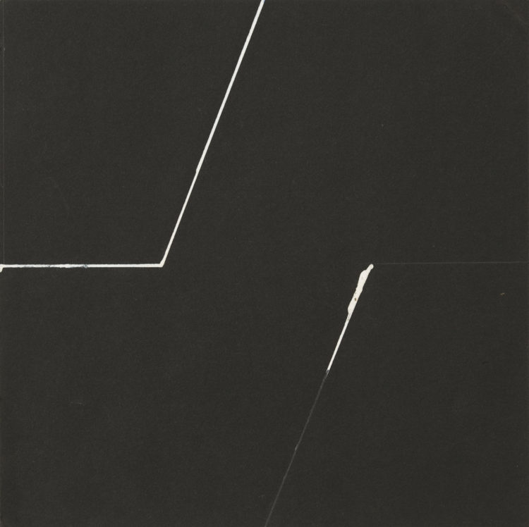
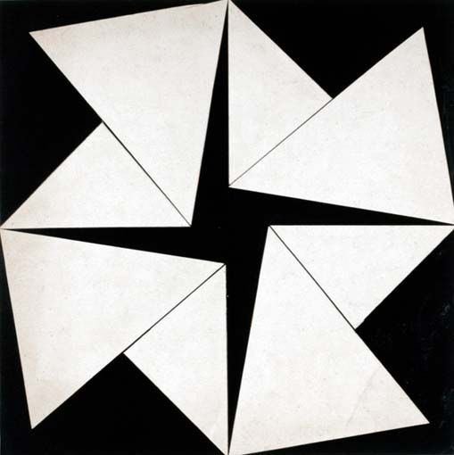
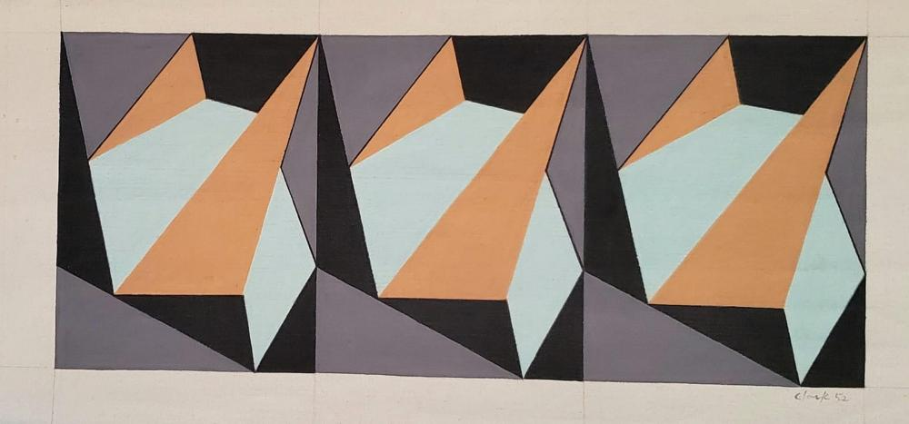
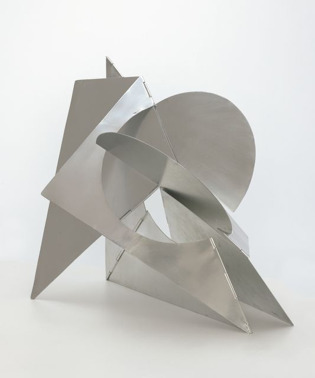
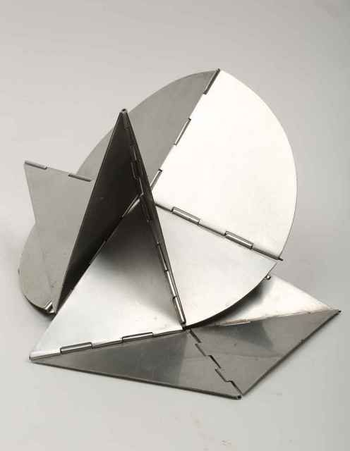

# Lygia Clark

**Lygia Clark** (23 de outubro de 1920 - 25 de abril de 1988), foi uma artista brasileira mais conhecida por seu trabalho de pintura e instalação. Ela se autointitulava "não artista". Ela foi frequentemente associada aos movimentos [construtivistas](https://en.wikipedia.org/wiki/Constructivism_(art)) brasileiros de meados do século 20 e ao movimento [Tropicália](https://en.wikipedia.org/wiki/Tropic%C3%A1lia). Também foi uma das fundadoras do movimento [neo-concret](https://en.wikipedia.org/wiki/Neo-Concrete_Movement)o (relacionado: [Grupo Frente](https://pt.wikipedia.org/wiki/Grupo_Frente)). As obras de Clark tratam da vida interior e dos sentimentos. Ela procurou redefinir a relação entre arte e sociedade. Por exemplo, ela foi pioneira do conceito de entender frequentadores de museus como participantes, descobrindo maneiras de permiti-los interagir com suas obras.

Nos anos 70, após afirmar ter abandonado a arte, Clark também explorou a ideia de percepção sensorial por meio de sua arte. Sua arte se tornou uma experiência multissensorial na qual o espectador se tornou um participante ativo. Seu trabalho mudou mais para a arte-terapia, mudando o foco para psicoterapia e cura, sendo usado para tratar pacientes psicóticos e levemente perturbados.

Do site da Associação Cultural Lygia Clark:

> Propagar as idéias e propostas de Lygia Clark como a artista gostaria que sua obra fosse vivenciada: como um estimulo á vida.

- http://www.lygiaclark.org.br/pt
- https://en.wikipedia.org/wiki/Lygia_Clark

# Obras

## Exibicoes

https://www.alisonjacquesgallery.com/exhibitions/137/overview/

## Obras

### O eu e o tu

https://www.moma.org/audio/playlist/181/2420

> O importante é o ato de fazer, no presente ... o artista se dissolve no mundo.
> --Lygia Clark

> The subjects' eyes are covered by these sensorial masks. So what I think is possible, is that while the subjects begin gendered as male and female, that as the exploration of the body is begun by these different subjects, that in some ways the subjects lose their gender, that they become all sensory experience, all skin, all body, all material.

https://www.youtube-nocookie.com/embed/5oxfmJpfVY4

### Bichos

https://www.moma.org/audio/playlist/181/2403

> Bichos desafiam ideias da escultura como forma idealizada estática. O visualizador pode dobrar, virar, fechar e abrir Bicho, explorando sua natureza multifacetada. Formada por formas geométricas conectadas por dobradiças, Lygia Clark criou uma escultura que não era apenas participativa, mas também aparentemente infinita em sua variabilidade.

> Vemos a natureza orgânica de Bicho, em consonância com as ideias do neoconcretismo, não só na sua forma exoesquelética e natureza transformadora, mas também no seu nome. Enquanto a escultura tradicional esconde seu suporte estrutural, Clark em vez disso se concentra nela, chamando a atenção para as dobradiças que unem a obra e para os espaços vazios criados entre esses espaços dobrados.

> Foi Ferreira Gullar, principal autor do "Manifesto Neo-Concreto", que chamou Bicho de nem pintura, nem escultura. Em vez disso, Gullar descreveu o trabalho como um não-objeto (uma frase inicial para abstração) que não tinha uma função e que resistia à categorização.
>

[Khan Academy](https://www.khanacademy.org/humanities/art-1010/latin-america-modernism/constructivism/a/lygia-clark-bicho)

https://www.youtube-nocookie.com/embed/lfitsC4m_dY

### A Casa é o Corpo

https://www.youtube-nocookie.com/embed/kiU26qNYxOI

### Caminhando

https://www.youtube-nocookie.com/embed/3sP-uT5DQLM

### Proposição "Rede de Elásticos"

https://www.youtube-nocookie.com/embed/eLBtgVDs3qs

### Proposição "Corpo Coletivo"

https://www.youtube-nocookie.com/embed/GlZbO_TYwW0

### Proposição "Túnel"

https://www.youtube-nocookie.com/embed/nsmk5L_OkCI

## Cesariana

https://www.youtube-nocookie.com/embed/KIVSrRhzNu

## Arquiteturas Biológicas

https://www.youtube-nocookie.com/embed/SawUX4JU8wk

## Critica artchistchica

https://www.youtube-nocookie.com/embed/67KZUV1xzfM
https://www.youtube-nocookie.com/embed/iUdNgLGqv6A
https://www.youtube-nocookie.com/embed/baPumEKFK40

https://www.youtube-nocookie.com/embed/2JZap5VxQmc
https://www.youtube-nocookie.com/embed/8iAMZ7N9Z28
https://www.youtube-nocookie.com/embed/1pzkJqGYhdY

https://www.youtube-nocookie.com/embed/
https://www.youtube-nocookie.com/embed/
https://www.youtube-nocookie.com/embed/

## Artigos

- https://awarewomenartists.com/en/artiste/lygia-clark/
- https://www.alejandradeargos.com/index.php/en/artp/282-lygia-clark-the-abandonment-of-art
- https://www.anothermag.com/art-photography/12340/celebrating-lygia-clark-a-radical-pioneer-of-contemporary-art-guggenheim-bilbao

## Lygia Clark ~ A E S T H E T H I C S ~

https://www.youtube-nocookie.com/embed/DRtH-YkUJsg

## Neo-Concrete

> In 1951, abstract art took on new meaning and form in Brazil, largely through the impact of a retrospective of the Bauhaus-trained artist Max Bill in São Paulo and the first São Paulo biennale. Throughout the 1950s, Bill's influence in Brazil led to the development of concrete art, a kind of abstract art, which championed universal subjects like order and rationality, founded on objectivity and science.Together with Helio Oiticica and other artists from Rio de Janeiro, however, Clark articulated her ideas about this kind of abstraction in the 1959 "Neo-Concrete Manifesto." In it, the artists declared their break from the tenets of concrete art with its systematic approach to abstraction. Clark, on the other hand, sought a freer and more organic interpretation of geometric abstraction, effectively eliminating the demarcation between two-dimensional and three-dimensional form.

## Dever de casa da Lygia Clark? 🤷

https://www.youtube-nocookie.com/embed/3VUjxy4_No4
