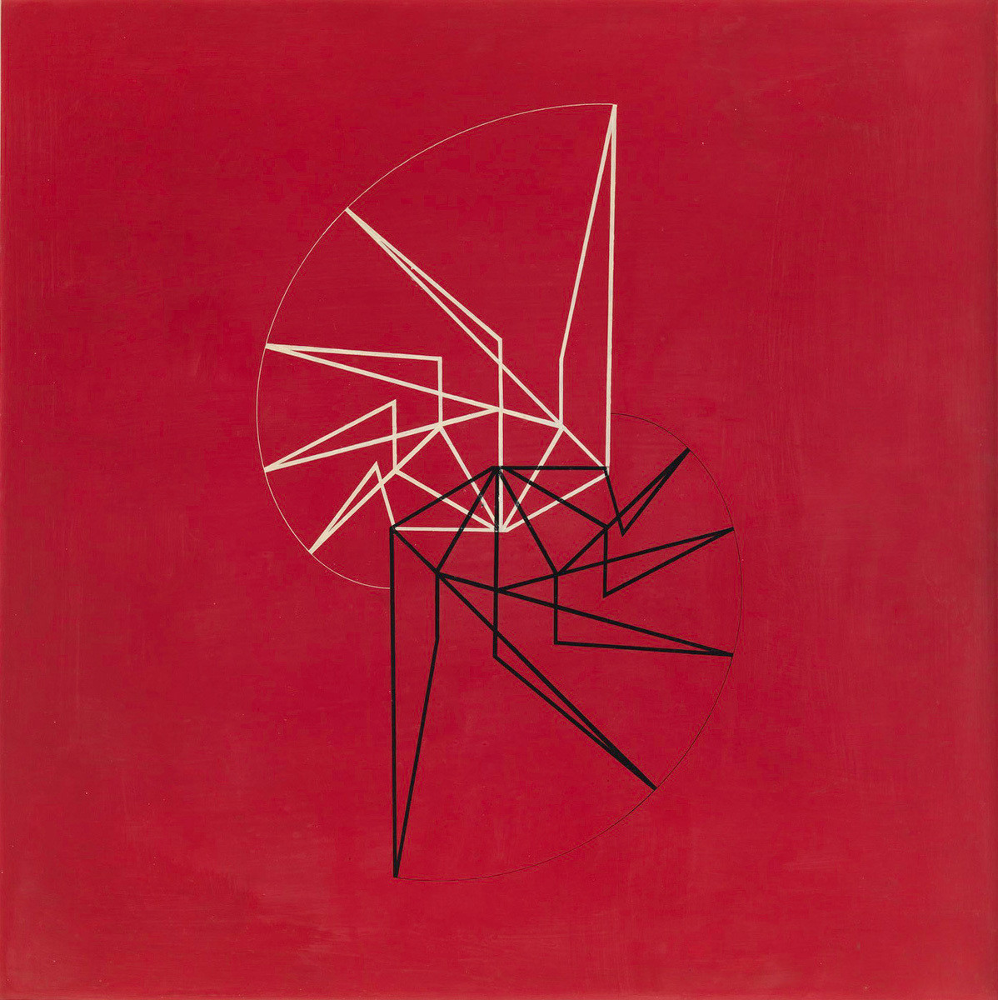
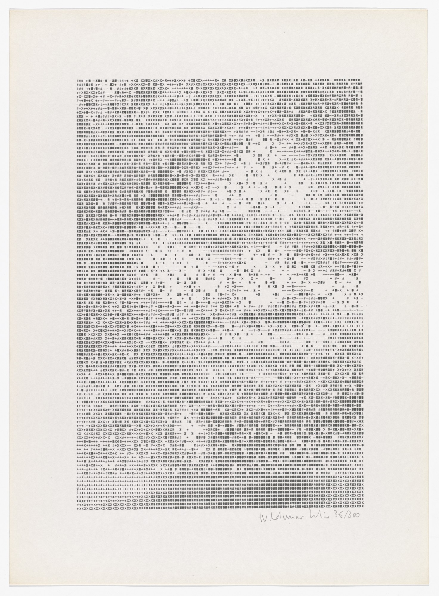
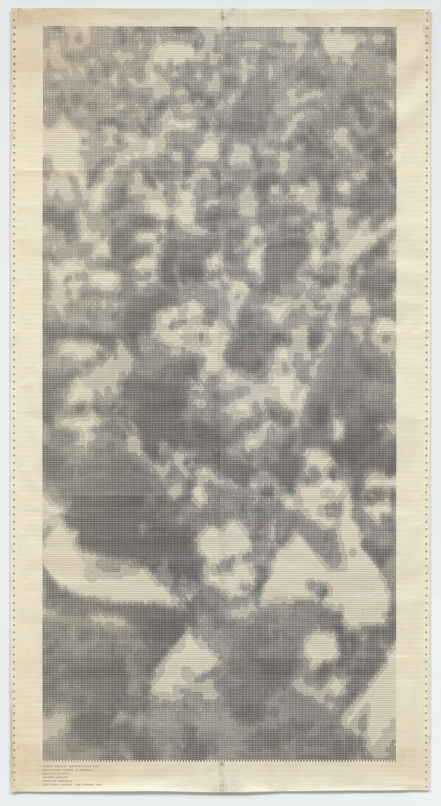
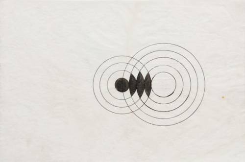
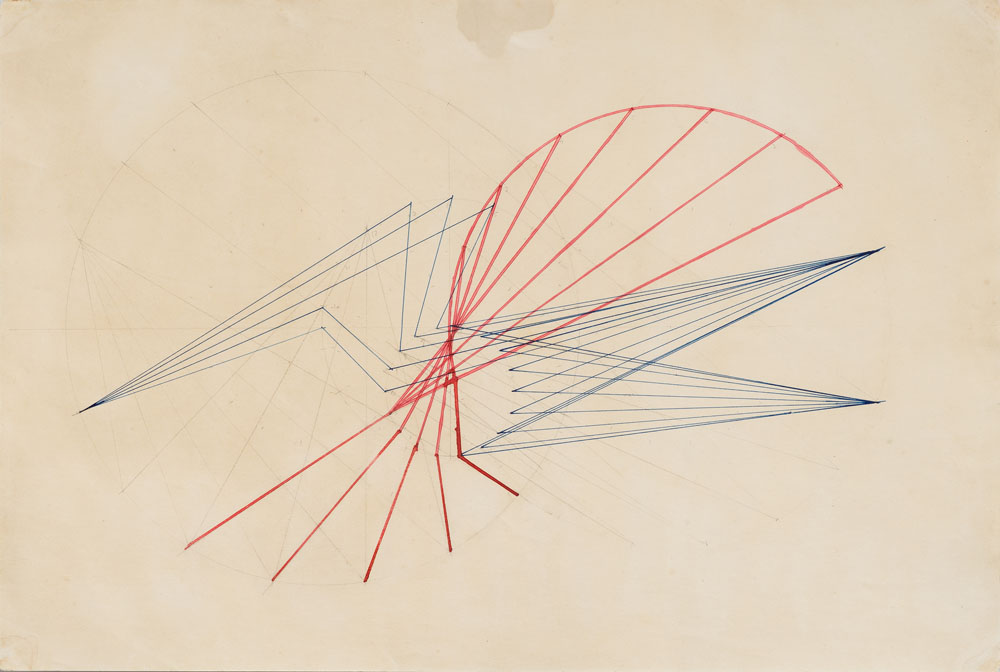

# Waldemar Cordeiro
**Waldemar Cordeiro** (April 12, 1924 – June 30, 1973) was an Italian-born Brazilian art critic and artist. He worked as a computer artist in the early days of [computer art](https://en.wikipedia.org/wiki/Computer_art) and was a pioneer of the [concrete art](https://en.wikipedia.org/wiki/Concrete_art) movement in Latin America.[[1]](https://en.wikipedia.org/wiki/Waldemar_Cordeiro#cite_note-GreyRoom-EarlyBrazilianDigitalCulture-2012-1)[[2]](https://en.wikipedia.org/wiki/Waldemar_Cordeiro#cite_note-MakingArtConcrete-2017-2):39

**Waldemar Cordeiro** (Roma, 12 de abril de 1925 — São Paulo, 30 de junho de 1973) foi um artista plástico, *designer*, ilustrador, paisagista, urbanista, jornalista e crítico de arte ítalo-brasileiro. Estudante do Liceu Tasso e da Academia de Belas Artes de Roma, criou, durante o [regime fascista italiano](https://pt.wikipedia.org/wiki/It%C3%A1lia_fascista), vínculo com membros do [Partido Comunista Italiano](https://pt.wikipedia.org/wiki/Partido_Comunista_Italiano), mantendo esta posição ideológica por toda sua vida.[[2]](https://pt.wikipedia.org/wiki/Waldemar_Cordeiro#cite_note-2) Fixando-se no Brasil nos anos 1940, participa da exposição inaugural do [Museu de Arte Moderna de São Paulo](https://pt.wikipedia.org/wiki/Museu_de_Arte_Moderna_de_S%C3%A3o_Paulo) e da primeira edição da [Bienal Internacional de Arte de São Paulo](https://pt.wikipedia.org/wiki/Bienal_Internacional_de_Arte_de_S%C3%A3o_Paulo).[[3]](https://pt.wikipedia.org/wiki/Waldemar_Cordeiro#cite_note-3) Cordeiro é conhecido principalmente por ter sido teórico e líder do grupo artístico [Ruptura](https://pt.wikipedia.org/wiki/Grupo_Ruptura), marco do [Concretismo](https://pt.wikipedia.org/wiki/Arte_concreta) no Brasil, e por ter sua participação no [Grupo Rex](https://pt.wikipedia.org/wiki/Grupo_Rex), cerne da [Nova Figuração](https://pt.wikipedia.org/wiki/Nova_Figura%C3%A7%C3%A3o) brasileira.[[4]](https://pt.wikipedia.org/wiki/Waldemar_Cordeiro#cite_note-4)

- https://en.wikipedia.org/wiki/Waldemar_Cordeiro
- https://pt.wikipedia.org/wiki/Waldemar_Cordeiro
- http://enciclopedia.itaucultural.org.br/pessoa297/waldemar-cordeiro
- https://www.moma.org/artists/42856

## Artwork

## Exposiçōes e catálogos

- [LATIN AMERICAN WORKS ON PAPER](https://dailyartfair.com/exhibition/7590/wifredo-arcay-carlos-cairoli-los-carpinteros-waldemar-cordeiro-hamlet-lavastida-mira-schendel-luis-tomasello-group-show-the-mayor-gallery)
- [Writing New Codes](https://dailyartfair.com/exhibition/8171/waldemar-cordeiro-robert-mallary-vera-molnar-group-show-the-mayor-gallery)
- [Fantasia Exata (Catálogo)](https://d3nv1jy4u7zmsc.cloudfront.net/wp-content/uploads/2015/05/publicacao_waldemarcordeiro.pdf)
- [Museu Virtual](https://www.itaucultural.org.br/museu-virtual/waldemarcordeiro/)

https://www.youtube-nocookie.com/embed/gCauBvJx9bo
https://www.youtube-nocookie.com/embed/P8P_W_pvWD8
https://www.youtube-nocookie.com/embed/gGCqsdirW9Q

https://www.youtube-nocookie.com/embed/2ouT5cy1Y6U
https://www.youtube-nocookie.com/embed/15nkIs40kYM
https://www.youtube-nocookie.com/embed/nGEkZUIT3So

https://www.youtube-nocookie.com/embed/pQ90gVX7cqY
https://www.youtube-nocookie.com/embed/0dFfbTQfC0c
https://www.youtube-nocookie.com/embed/Rr5tgGDq5RE

https://www.youtube-nocookie.com/embed/SICpg0-qllA
https://www.youtube-nocookie.com/embed/_aTQNx4vGL0
https://www.youtube-nocookie.com/embed/tysKkCmvogs

## Arquitetura

## Outros Materiais

https://www.youtube-nocookie.com/embed/5yz5QE0_hTU

https://www.youtube-nocookie.com/embed/SICpg0-qllA

Projetos feitos durante o curso Recreating the Past da School for Poetic Computation: https://docs.google.com/presentation/d/1oZKqfZcPlffNerq9TVY6gtqxfmuuQ71iDdg3lt-sCRc/edit?usp=sharing
